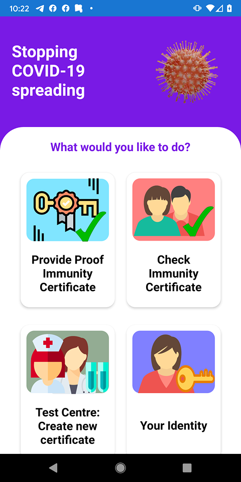
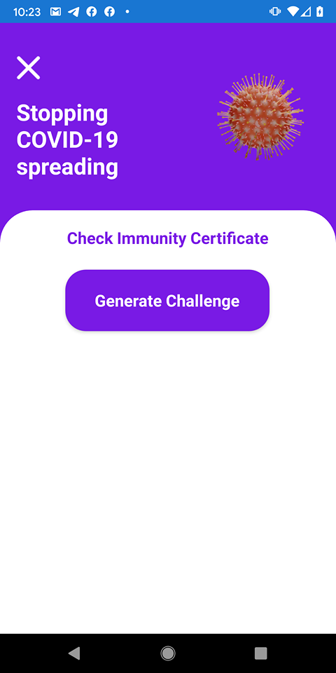
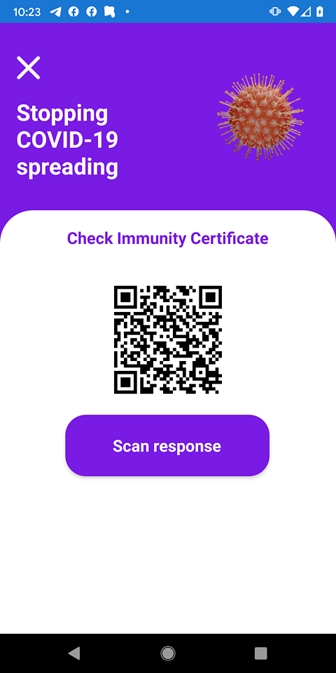
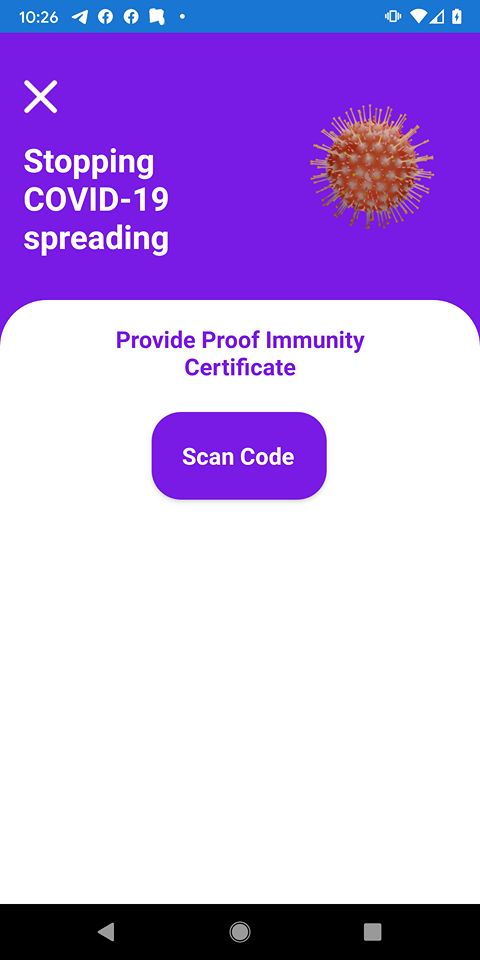
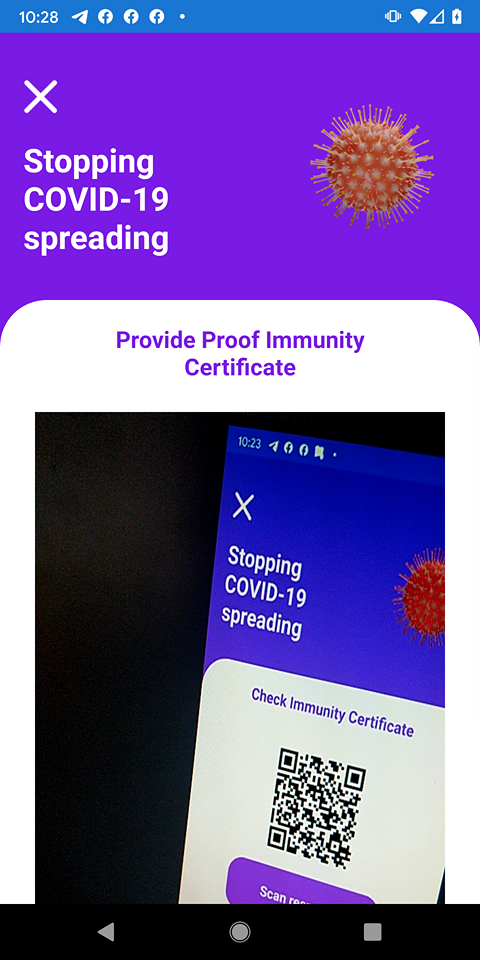
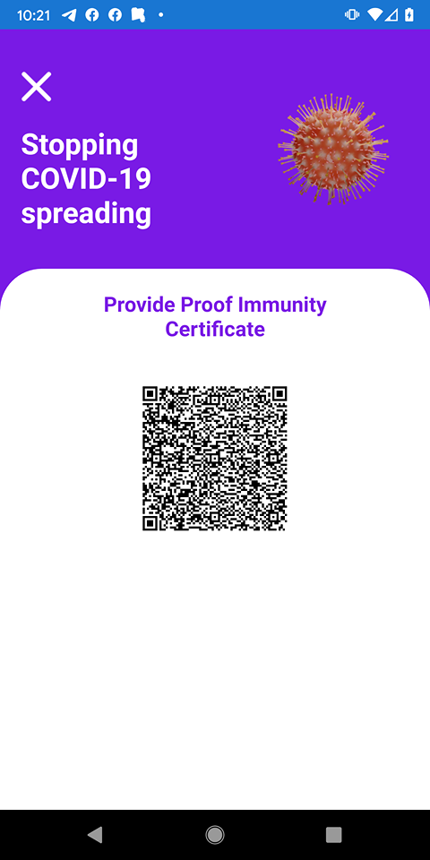
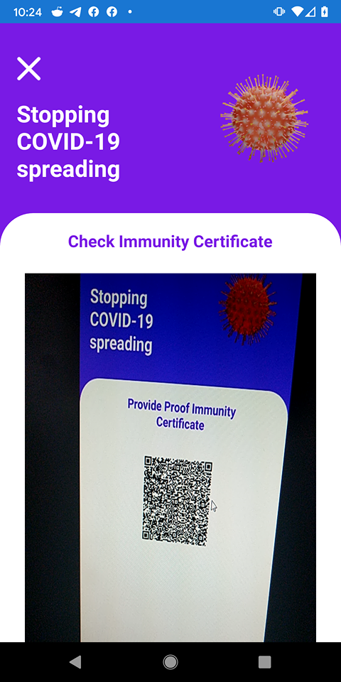
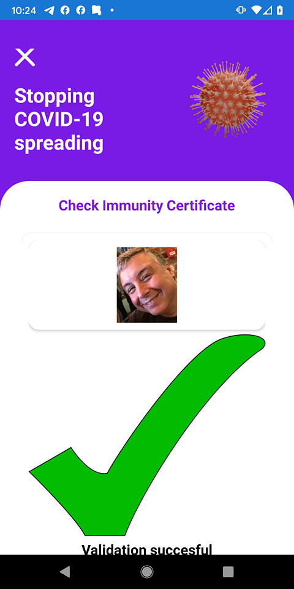

# Covid19 Immunity Certification and attestation PoC

This is a PoC of a way to enable a person and / or institution to verify another person has a valid immunity certificate. Hopefully this can inspire or help anyone working on this, feel free to use anything here. Remember to credit correctly if you use any images / icons (see links at the bottom for attributions for those resources)

Current progress: Mobile application(s) validation process flow completed, currently working on finishing smart contracts


Please feel free to either:
* Pick of any of the current issues marked as help wanted, participate on the ones marked for discussion (mainly anyone really) or create an issue for any new feature.
* Send a message on the Nethereum gitter channel https://gitter.im/Nethereum/Nethereum# or Juan Blanco in @juanfranblanco twitter for a chat if you want to help. 
* Please make a pull if you find any grammar mistakes, in this readme (current documentation) everything is WIP.

## Why?

As testing of immunity for corona virus becomes more widely available, it will allow us to start helping people or visiting family members that are at risk, happily knowing that we won't put them at danger.

Those people at risk who could be our loved ones, require that any people that comes close to them can validate themselves as immune. This could include any person coming to provide any volunteering help.

As we have seen many people have died in hospital and residences, the problem exacerbates in this type of places due to the amount of people at risk. Here the people at charge need to make sure that nobody enters the building which could carry the virus, many people might be anxious to see their loved ones there, without realising the risk associated with it as well, hence the requirement to put this type immunity validation.

Obviously there are many other scenarios like returning to work, resuming live events and big crowd gatherings ...

## What is a COVID19 immunity certificate
An immunity certificate provides a confirmation that a person has tested positive (only) for the lgG antibodies. Please see diagram of the different types of test results used in the hospital La Paz (Madrid). (To be translated from Spanish)


The scope of the current project is to provide only attestation of an immunity certificate, not to carry all the different variants of test results. These should be part of the testing centre.

## Constraints

Certificates need to be borderless (not specific to a country), maintain user privacy, cheap to create using existing technology, should work in semi disconnected scenarios, and not require some government id as these are not required in some countries or children may not have one, limit the information to avoid discrimination (could be used for positive discrimination or negative in case of an invalid test). 

## Technology

The example includes an Android and iOS mobile application which can be used both by the certificate validator and the owner of the certificate, communinication between both devices is done exchanging qr codes.

Ethereum smart contract (public) to store valid Test Centres, Test Centre certificate issuers (who creates and sign the certificates), Expired / Invalidated Certificates, Test Centres or Issuers (which may invalidate previous certificates). 

The data stored in smart contracts is limited to test centres and expired certficates as opposed to individual certificates to simplify scalability (7 billions versus and approx of 700,000 test centres handling 10,000 people each).

Ethereum accounts to integrate with Ethereum but also enable secp256k1 to sign and validate certificates.

IPFS to store users photos to enable physical validation of certificates

## What this won't do or it is out of scope at the moment (pragmatism based on current circunstances)
+ Demonstrate storage in test centres of certificates, results, etc.
+ DIDs, decentralised identity usage as we just want to create a simple certificate that can be used by any technology (literally comma separated values). This could / will be upgraded in the future.

## Certification Validation Process
The process of validating a certificate is the following.
1. The validator will generate a challenge (random text) for the owner of the certificate to sign with the private key and account which is part of the certificate, this will be display as a QR Code.
2. The QR challenge will be scan and signed by the owner of the certificate and respond as another QR code containing both the certificate and the signature of the challenge.
3. The Certificate validator will scan now the QR response and start the validation process.
4. First will validate the certificate, by checking if the signature of the certificate matches the data included in the certificate. 

**Data included in the certificate (as of now)**

* Test centre id (The test centre where the certificate originates)
* Test centre signer (Who has validated the test results and has created the certificate in the test centre)
* User / certificate id (ethereum address to uniquely identify the certificate and to validate user)
* User photo hash (IPFS hash to validate the user physically)
* Signature (To validate the data has not been tampered and check the test centre signer)

3. Validate the challenge signature, using the certificate and the signed challenge, we will be able to validate the user matchs the one in the certificate

4. We will connect to an Ethereum smart contract (assumed public) to validate the following.
* Is the test centre id valid and has not been flagged as invalid test centre (for example bad batch of test kits, batch could be added to the certificate)
* Is the signer valid and included in the approved signers
* Is the certificate valid, and has not been forced to expiry (ie further checks has invalidated the immunity)


### Physical validation
An IPFS hash of a photo of the user is included in the certificate, so the person validated the certification can check the certificate belongs to the person without requiring any other form of identification or id attached to the certificate as these might not be available in some countries. This could prevent also lending a device / certificate to another person. 

#### Storage 
Assuming that we store 500kb photos in IPFS, we would need 1TB for around 2 million photos.

## Certification Validation Process Sequence diagram and screen flows


<table>
	<tr><th>Step</th><th> Actor(s)</th> <th> Description</th><th width="160">Screenshot</><tr>
	<tr>
		<td>1</td><td>Certificate Validator -> Validator Mobile</td>
		<td><b>Open screen Check Immunity Certificate</b><br> The certificate validator will select from the home screen the menu item "Check Immunity Certificate" to start the validation process</td>
		<td> </td>
	</tr>
	<tr>
		<td>2</td><td>Certificate Validator -> Validator Mobile</td>
		<td><b>"Check Immunity Certificate" screen, generate challenge</b><br> The certificate validator will generate a unique "qr code" challenge and wait for the certificate owner to scan it to validate its identity. This unique challenge (some random text) will be signed by the validator using its private key which if matched to the cert owners id (ethereum address) to validate authenticity. There might be scenarios that some unique challenge could be shared across different people to speed up the process, for example a long queue.</td>
		<td> 
		
		</td>
	</tr>
	<tr>
		<td>3</td><td>CertificateOwner -> CertOwnerMobile -> ValidatorMobile</td>
		<td><b>"Certificate owner, scan challenge"</b><br> The certificate owner now will go to the screen "Provide Proof of Immunity Certificate" and scan the the challenge generated by the validator. 
		<td> </td>
	</tr>
	<tr>
		<td>4</td><td>Certificate Owner Mobile</td>
		<td><b>Generate QR Response (Certificate + Signed Challenge)</b><br> 
		The certificate owner mobile will generate a qr response following these steps: <br>
			1. Get Certificate from the mobile secure storage <br>
			2. Get Private Key from the mobilie secure storage <br>
			3. Sign the scanned qr code challenge using the private key. The signature will be used to match the certificate owner. <br>
			4. Generate the QR Response (Certificate + Signed Challenge), this is a simple text pipe (|) delimited of the certificate and the signature of the challenge <br>
			5. Display the QR code <br>
		</td>
		<td> 
		</td>
	</tr>
	<tr>
		<td>5</td><td>Certificate Validator -> Certificate Validator Mobile -> Certificate Owner Mobile</td>
		<td><b>Validator, scan Certificate Owner response and validate response and certificate</b><br> 
		To validate the the certificate and signed challenge, the validators mobile device will: <br>	
		1. Scan the QR code with the signed <br>
2. Validate the certificate, which will check if the signature of the certificate matches the data included in the certificate. 
The data included in the certificate as per the current example is: <br>

* Test centre id (The test centre where the certificate originates) <br>
* Test centre signer (Who has validated the test results and has created the certificate in the test centre) <br>
* User / certificate id (ethereum address to uniquely identify the certificate and to validate user) <br>
* User photo hash (IPFS hash to validate the user physically) <br>
* Signature (To validate the data has not been tampered and check the test centre signer) <br>

3. Validate the challenge signature, using the certificate and the signed challenge, we will be able to validate the user matchs the one in the certificate <br>

4. We will connect to an Ethereum smart contract (assumed public) to validate the following. <br>
* Is the test centre id valid and has not been flagged as invalid test centre (for example bad batch of test kits, batch could be added to the certificate) <br>
* Is the signer valid and included in the approved signers <br>
* Is the certificate valid, and has not been forced to expiry (ie further checks has invalidated the immunity)

5. Finally it will retrieve from IPFS the certificate owners photograph to display it on the screen<br>
		</td>
		<td> 
		</td>
	</tr>
	<tr>
		<td>6</td><td>Certificate Validator -> Certificate Validator Mobile -> Certificate Owner</td>
		<td><b>Display validation result and physically validate certificate owner photograph</b><br> 
		An IPFS hash of a photo of the user is included in the certificate, so the person validated the certification can check the certificate belongs to the person without requiring any other form of identification or id attached to the certificate as these might not be available in some countries. This could prevent also lending a device / certificate to another person. 
		</td>
		<td> 
		</td>
	</tr>
</table>


## TODO
+ Finish smart contracts
+ Create certificate process screens
+ Register test centre
+ Invalidate certificate
+ Semi connected scenarios, can we sync with Ethereum data to enable to validate locally..

# Credits
Many thanks to:

+ David Blanco (Providing medical information and material)
+ Aaron Kindell, Kevin Small, Sasha Tanase (Feedback, review and brainstorming thoughts)
+ You for reading til here
+ ...

## Resources Credits
Many thanks to the people creating this invaluable resources:

Chased Home UI Design  https://github.com/ufukhawk/Chased-Home-UI-Design the Xamarin template used for the application
J Suarez Ruis https://github.com/jsuarezruiz/xamarin-forms-goodlooking-UI for creating the Xamarin Forms GoodLooking UI (Template found there)

### Images / Icons used
CoronaVirus 
Dianakuehn30010 at https://pixabay.com/illustrations/virus-isolated-corona-coronavirus-4930122/

User Icons
https://iconstore.co/icons/wow-user-icons/

Key Certificate Icon
https://www.flaticon.com/free-icon/public-key-certificate_1792214

Nurse Icon
https://www.svgrepo.com/svg/40592/nurse

Blood Test Icon
https://www.svgrepo.com/svg/96961/blood-test


## Certificate creation 

This is an example of how the certificates are created, you can copy this and run it in the Nethereum playground http://playground.nethereum.com

```csharp
using System;
using System.Text;
using Nethereum.Hex.HexConvertors.Extensions;
using System.Threading.Tasks;
using Nethereum.Web3;
using Nethereum.Signer;
using Nethereum.Util;

public class Program
{

    static async Task Main(string[] args)
    {
				//The test centre Id could be an ipfs hash that includes all the information (maybe a did including endpoints to ethereum and ipfs gateways)
				var testCentreId = "100";
				var testCentreSupervisorPrivateKey = "0xb5b1870957d373ef0eeffecc6e4812c0fd08f554b37b233526acc331bf1544f7"; 
				//cheating use the same
				var userAddress = "0x12890d2cce102216644c59daE5baed380d84830c";
				// The users photo ipfs hash 
				// An ugly man smiling here:
				// https://gateway.pinata.cloud/ipfs/QmbtqAxAnEqumx9k8wx8yxyANpC5vVwvQsdSWUQof9NP2o
				var photoId = "QmbtqAxAnEqumx9k8wx8yxyANpC5vVwvQsdSWUQof9NP2o";
				Console.WriteLine("Full certificate generated:");
				Console.WriteLine(CertificateService.CreateCertificate(userAddress, testCentreId, testCentreSupervisorPrivateKey, photoId).FullCertificate);
    }

		public class CertificateService
    {
        public static SignedCertificate CreateCertificate(string userAddress, string testCentreId, string privateKey, string photoUserId)
        {
            var ethEcKey = new Nethereum.Signer.EthECKey(privateKey);
            var signer = new Nethereum.Signer.EthereumMessageSigner();
            var signerAddress = ethEcKey.GetPublicAddress();
            var signature = signer.EncodeUTF8AndSign(SignedCertificate.GetRawCertificate(userAddress, signerAddress, testCentreId, photoUserId), ethEcKey);
            return new SignedCertificate(userAddress, signerAddress, testCentreId, photoUserId, signature); 
        }
    }


		public class SignedCertificate
    {
        public static string GetRawCertificate(string userAddres, string signerAddress, string testCentreId, string photoId)
        {
            return $"{userAddres},{signerAddress},{testCentreId},{photoId}";
        }
        /// <summary>
        /// The full certificate containing the "UserAddress,SignerAddress,TestCentreAddress,Signature"
        /// </summary>
        public string FullCertificate { get; private set; }

        /// <summary>
        /// The certificate containing the value "UserAddress,SignerAddress,TestCentreAddress"
        /// </summary>
        public string RawCertificate { get => GetRawCertificate(UserAddress,SignerAddress,TestCentreId, PhotoId); }
        /// <summary>
        /// The User Address (Unique Identifier for the current signed certificate) 
        /// </summary>
        public string UserAddress { get; private set; }
        /// <summary>
        /// The Signer Address (Unique Identifier for the signer) (this would be ideally the Test Supervisor of the TestCentre)
        /// </summary>
        public string SignerAddress { get; private set; }
        /// <summary>
        /// The Test Centre Address or Unique Identifier (An address could be used for signing verification purpouses or ENS to resolve it)
        /// </summary>
        public string TestCentreId { get; private set; }
        /// <summary>
        /// Photo IPFS Hash of the User Photo
        /// </summary>
        public string PhotoId { get; private set; }
        /// <summary>
        /// The Test Centre Address or Unique Identifier (An address could be used for signing verification purpouses or ENS to resolve it)
        /// </summary>
        public string Signature { get; private set; }

        public SignedCertificate(string fullCertificate)
        {
            this.FullCertificate = fullCertificate;
            InitialiseFromFullCertificate(fullCertificate);
        }

        public SignedCertificate(string userAddress, string signerAddress, string testCentreId, string photoId, string signature)
        {
            this.UserAddress = userAddress;
            this.SignerAddress = signerAddress;
            this.TestCentreId = testCentreId;
            this.PhotoId = photoId;
            this.Signature = signature;
            GenerateFullCertificate();
        }

        private void GenerateFullCertificate()
        {
            FullCertificate = $"{UserAddress},{SignerAddress},{TestCentreId},{PhotoId},{Signature}";
        }

        private void InitialiseFromFullCertificate(string fullCertificate)
        {
            var values = fullCertificate.Split(',');
            UserAddress = values[0];
            SignerAddress = values[1];
            TestCentreId = values[2];
            PhotoId = values[3];
            Signature = values[4];
        }

        public bool IsCertificateValid()
        {
            var signer = new EthereumMessageSigner();
            var recoveredAddress = signer.EncodeUTF8AndEcRecover(RawCertificate, Signature);
            return recoveredAddress.IsTheSameAddress(SignerAddress);
        }
    }
}
                
```
